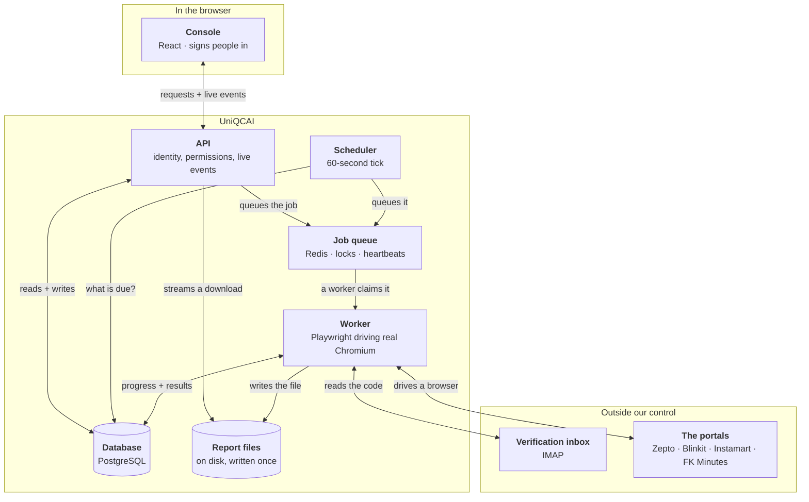

# What UniQCAI is made of

Nine moving parts, and what travels between them.

> The interactive version of this diagram — click a block to read what it does,
> play a collection through it, switch between overview and detail — is the page
> published alongside this file. This is the same picture as text, so it can be
> pasted into a wiki or a slide.

## The parts

| Part | What it is | What it does |
|---|---|---|
| **Console** | React 18 + TypeScript, in the browser | The only part anyone sees. Holds no data of its own. |
| **API** | FastAPI, Python 3.12 | Checks identity and permission on every request. Encrypts secrets before they are stored, and never sends them back out. |
| **Job queue** | Redis | Holds work until a worker is free. Also holds the per-login locks and each collection's heartbeat. |
| **Scheduler** | A small Python process, `croniter` | Every minute, asks what is due, resolves its dates in IST, and queues it. Also fails collections that have gone quiet. |
| **Database** | PostgreSQL 16 | All state: brands, access, logins, timetables, and every collection ever run. Secrets encrypted at rest. |
| **Worker** | Dramatiq + Playwright + headed Chromium | Signs in to the portals and downloads. One small adapter per portal; nothing else knows a portal exists. |
| **Verification inbox** | IMAP, outside our control | Where the portals email sign-in codes. Only matching messages, only those sent after we asked, each used once. |
| **Report files** | A volume on disk | The downloaded bytes, written once and never touched. Served only through the API, after a permission check. |
| **The portals** | Outside our control | Zepto, Blinkit, Swiggy Instamart, Flipkart Minutes. |

## One collection, end to end

1. **Something starts it** — a person presses Run now, or the scheduler reaches a due timetable.
2. **It is written down first** — the collection and one job per report, before any work begins.
3. **It joins the queue** — and the API answers the console immediately.
4. **A worker claims it** — and locks that platform login for the duration.
5. **It signs in** — reusing the previous session where it is still valid, otherwise waiting for a code.
6. **It checks whose business it is** — and stops, downloading nothing, if the portal opened the wrong one.
7. **The reports download** — each written once, byte for byte, with its checksum.
8. **And you watch it happen** — every step streamed to anyone with the collection open.

---

*Stage A collects reports. Parsing, dashboards and campaign actions are later
stages and are not shown here.*
