# UniQCAI — how it works

**A walkthrough for approval**
Prepared by Digital Upshot · 22 September 2026 · Version 1.0

> The screens in this document are interface previews, not photographs of live
> data. Brand names, email addresses and numbers are invented placeholders.
> Screens marked **Designed — not yet built** show an agreed design that has
> not been implemented yet; every other screen exists today.

---

## 1. What UniQCAI does

Right now, getting a week of quick-commerce reporting means someone signs in to
five different seller and advertiser portals, waits for a code to arrive by
email, picks the right business, sets the same date range five times, and
downloads the same twenty files by hand. It takes a person an hour a day, it
happens late when that person is busy, and nobody can tell afterwards whether a
file was pulled for the right dates.

UniQCAI does that collection round for you. You connect each brand to each
platform once. After that you either press a button or leave a timetable
running, and the files arrive in one place, named consistently, ready to open.

**What it does not do, deliberately.** This stage collects files. It does not
read what is inside them, build dashboards, compare platforms, or change
anything in your campaigns. Those are later stages, and the work here is built
so they can be added without moving what you have approved.


---

## 2. Who uses it

| | Who they are | What they can do |
|---|---|---|
| **Super admin** | One or two people at Digital Upshot | Everything, including system settings and the full activity log |
| **Admin** | The Digital Upshot team running the service | Every brand. Creates brands, enters logins, grants access |
| **Brand user** | Your team | Only the brands they are given, at one of two levels |

A brand user is granted a brand at one of two levels:

- **Manager** — enters logins, edits timetables, starts collections, downloads everything for that brand.
- **Executive** — sees and downloads that brand's reports and history. Starting a collection is a separate permission, granted per person, and it is **off unless someone turns it on**.

Someone with no grants sees nothing at all, not an empty list of other people's
brands.

**Passwords are never visible to anyone.** Once a platform password is saved it
can be replaced, but it cannot be read back — not by an administrator, not
through the interface, not in any log, export or error message. The same is
true of sign-in codes.

---

## 3. How reports are organised

Everything you see is grouped the same way: **platform first, then Ads or
Sales, then the individual report.** You never have to know the internal name of
the website a report comes from.


Two consequences are worth stating plainly, because they shape the setup:

- **A login is connected to a brand, not owned by one.** Agency logins that carry several brands are normal, and UniQCAI is built for them.
- **One login often covers both Ads and Sales.** Where it does, you enter it once.

Because one login can open more than one business, every connection records
which business it is *supposed* to open. That record is checked on every single
collection — see section 6.

---

## 4. Connecting a brand

This happens once per brand per platform, and takes a few minutes.

### Step one — pick the platform and what you want from it



### Step two — the login

One login block per category, with a toggle for *Ads and Sales use the same
login*. An existing login can be reused rather than retyped, which is how one
agency login comes to serve three brands.

### Step three — where the sign-in code arrives

Most of these portals will not accept a password alone. They email a numeric
code, or a one-time sign-in link. So each login is pointed at an inbox that
receives those messages.



The inbox can be one the portal emails directly, or one that messages are
forwarded to. The rule underneath — which sender, which subject, what the code
looks like — comes supplied for each portal. You can change it, and you can
**test it against a real message before saving**, which is what the green line
in the screen above is showing.

### Step four — pick the reports, then prove it works



Setup ends with a real sign-in, streamed step by step while it happens. You
watch it open the portal, enter the login, wait for the code, sign in and
confirm the business. Nothing is guessed and nothing is saved on trust.

---

## 5. Asking for reports

### Now



Pick the brand, tick the reports, choose a date range. Presets cover yesterday,
the last seven days, this month and the previous month; dates are always India
Standard Time.

Where a portal limits how much you can export at once, the panel says so and
offers to split the request. Zepto's files carry no dates inside them at all,
so it offers to split those by day — otherwise, a week of Zepto is one file you
cannot tell apart from any other week.

### Or on a timetable



Daily, weekly or monthly, at a time you choose. Each timetable says which dates
it should pull — usually a rolling window such as *the last three days*, so
that late-arriving corrections get picked up.

The preview line is the important part: it spells out, in real dates, what the
next two runs will actually ask for. Almost every scheduling mistake shows up
there before it costs a day of data.

---

## 6. What happens while it runs


### Getting past the sign-in code


Where a session from last time is still valid, UniQCAI reuses it and no code is
needed at all. That is the common case on a daily timetable.

### Four promises about the collection

1. **It checks it is on your business before it downloads anything.** It reads back which business the portal actually opened and compares it with what the connection expects. If they differ it stops and downloads nothing. This matters more than it sounds: a wrong pick produces a complete, believable file for somebody else's business, and no later check would catch it.
2. **One login is never driven twice at once.** A second request for the same login waits its turn rather than fighting it and getting both locked out.
3. **It retries the right failures and refuses the wrong ones.** A timeout, a slow portal or a changed page is tried again. A rejected password is not — retrying that risks locking the account — and neither is a wrong business.
4. **A collection that dies is reported as failed.** If the machine doing the work stops, the run is marked failed within minutes rather than sitting on screen as "running" forever.

### Watching it happen


The live view groups work by login and shows every step as it happens, with
elapsed times. It updates itself; nothing here needs refreshing. When something
fails, the row expands to explain it in plain words, with a screenshot of what
the portal was showing at the moment it broke.

Finished collections keep the whole log, so a question three weeks later —
*did that Tuesday actually pull?* — has an answer.


---

## 7. Where the files end up



**The file you download is exactly what the portal produced.** The bytes are
never edited, never re-saved, never stamped. Only the *name* is ours:

```
northwind_blinkit_ads_mtd-search_2026-09-14_2026-09-20.xlsx
brand      platform  category  report      from        to
```

That is not cosmetic. Several portals hand back names like `export(3).xlsx`,
and Zepto's exports contain no date column anywhere, so without a generated
name there is no way to tell one period from another. The portal's own filename
is kept alongside, in case you ever need it.

**Every version is kept.** Blinkit in particular restates figures after the
fact — the same campaign-day can change days later. So each pull is stored
separately, the newest is flagged, and older ones stay available. Nothing is
overwritten.

Files can be taken one at a time or as a zip, and a filter set can be shared as
a link.

---

## 8. What your brand teams see


A brand contact gets a much smaller app: their brand, how fresh each platform
is, the latest files, and a button to take the lot. No setup, no other brands,
no other clients. It works on a phone, because grabbing a file is often
something done between meetings.

---

## 9. The rest of the administration

These exist for the Digital Upshot team rather than for you, but they are part
of the approval because they determine what we can answer when you ask.



Every brand has one page showing each platform, an Ads row and a Sales row,
what state each is in, and when each last succeeded.







There is also a full activity log: who changed which login, who downloaded
which file, when.


---

## 10. Where each platform stands today


| Platform | Ads | Sales |
|---|---|---|
| **Zepto** | Working today — collects end to end | In build |
| **Blinkit** | Scheduled | Scheduled |
| **Swiggy Instamart** | Scheduled | Scheduled |
| **Flipkart Minutes** | Scheduled | Scheduled |
| **BigBasket** | On hold | On hold |

Zepto Ads is complete and has collected real reports end to end. The rest have
had their reports catalogued and their sign-in behaviour worked out; the
collection steps are the remaining work, and they get faster now that
everything shared between platforms is built once and proven.

BigBasket is the one genuine unknown: it requires a Google sign-in with
two-factor authentication, which behaves differently from the others. It is
parked rather than attempted, pending your decision in section 11.

The *shape* of the product does not change as those fill in. That is what this
document is asking you to approve.

---

## 11. What we need from you

### Decisions

| # | Question | Why it matters |
|---|---|---|
| 1 | **How long should we keep the raw files?** | Storage and cost. Our suggestion is to keep everything for the first year and revisit. |
| 2 | **Which Blinkit seller (Sales) reports do you actually use?** | The list is not yet fixed. We would rather build the four you open than the twelve you do not. |
| 3 | **Which Flipkart Seller Hub reports count as Flipkart Minutes Sales?** | Seller Hub carries more than Minutes. We need your list to scope it. |
| 4 | **May a brand Manager enter their own platform logins, or should that stay with Digital Upshot?** | Changes who can set a brand up, and how fast onboarding goes. |
| 5 | **Who signs off that Zepto's numbers are right?** | Before we roll out the remaining platforms we want one named person to confirm the Zepto files match what they see in the portal. |
| 6 | **Do you want us to pursue BigBasket?** | It needs a Google sign-in with two-factor authentication. Worth doing only if BigBasket matters to you commercially. |
| 7 | **Daily at what time?** | Portals finish yesterday's figures at different hours. A default of 06:00 IST is our suggestion. |

### Access and material

| # | What | Why |
|---|---|---|
| 8 | **Platform logins** for each brand and platform, entered once into the setup screen | Nothing can be collected without them. They are encrypted immediately and never shown again. |
| 9 | **An inbox for sign-in codes**, or a forwarding rule into one we set up | This is how the codes reach us. One inbox can serve every platform. |
| 10 | **Two or three example forwarded code emails** | If codes reach us by forwarding rather than directly, we need real examples to prove the matching works before go-live. This is the last open item on setup. |
| 11 | **Names and emails of the brand contacts** who should get access, and at which level | So we can invite them. |

### Questions about the numbers themselves

These do not block anything, but they change what a future dashboard would be
able to claim, so they are cheaper to answer now:

- **Blinkit** restates figures after the day closes. How many days back do you consider settled? And when two Blinkit exports disagree, which one do you treat as the truth?
- **Instamart's** most granular export accounts for noticeably less spend than its summary. Do you know what it filters out?
- **Zepto** reports a metric we cannot derive from anything else in the file. We would like to ask Zepto jointly what it measures.

---

## 12. Sign-off

Approving this document means you agree that:

- the journey in section 1 is how you want this to work;
- the roles and permissions in section 2 match how your teams are organised;
- the setup, collection and download screens are right in principle;
- the file-handling promises in section 7 — unedited bytes, generated names, every version kept — are what you expect;
- the platform order in section 10 is the right order.

What stays cheap to change after approval: wording and labels, which reports
are ticked by default, timetable times, who gets access, the order platforms
are built in.

What becomes expensive: the grouping of platform → Ads/Sales → report, the
two-level brand permission model, and the decision to store files untouched
rather than reshaped on the way in.

| | |
|---|---|
| **Approved by** | |
| **Role** | |
| **Date** | |

---

### Appendix — words used on screen

| Word | Means |
|---|---|
| **Brand** | One of your brands. Everything is grouped under one. |
| **Platform** | Zepto, Blinkit, Swiggy Instamart, Flipkart Minutes, BigBasket. |
| **Category** | Ads or Sales. |
| **Report** | One export, such as *Campaign performance*. |
| **Connection** | A brand joined to a platform login, including which business that login should open. |
| **Run** | One collection. Contains one job per report. |
| **Schedule** | A timetable that starts runs by itself. |
| **Version** | An earlier pull of the same report for the same dates, kept after the portal restated its figures. |

| Status | Means |
|---|---|
| **Queued** | Waiting its turn, usually behind another job on the same login. |
| **Running** | In progress. |
| **Waiting for OTP** | Signed in, waiting for the emailed code to arrive. |
| **Succeeded** | Everything asked for was collected. |
| **Partially succeeded** | Some reports arrived, some did not. The log says which. |
| **Failed** | Nothing was collected. The log says why. |
| **Healthy / Needs attention / Untested** | The state of a saved login: working, broken, or never yet tested. |
