# UniQCAI

**Every quick-commerce report, collected for you, in one place.**
Digital Upshot Pvt Ltd

> The short version. For the full walkthrough — setup in detail, what happens
> inside a collection, platform coverage and the decisions we need — see
> [`FLOW.md`](FLOW.md).

---

## The morning it replaces

Five portals. A sign-in code emailed at each one. The same date range typed five
times. About an hour a day.

And afterwards, no way to prove which dates a file actually covered — several of
these exports carry no dates inside them at all.

---

## Who does what

Setting up is ours, and happens once per brand. Collecting is automatic. Using
it takes your team seconds.

---

## Setting it up

Connecting a brand to a platform takes a few minutes, and ends with a **real
sign-in you watch happen** — step by step, while it happens. Nothing is saved on
trust.

*The same screen in light and dark. UniQCAI follows whatever each person's
device is set to.*

---

## Then it collects on its own

On a timetable, or whenever you press the button. You can watch it work — and it
says plainly when something needs a person.

---

## Every report in one place

The file you download is exactly what the portal produced, never edited. Only
the name is ours — so the brand, platform, report and dates read straight off
it. Every version is kept.

---

## What your team sees

Their brand, newest first, and one button for the lot. It works on a phone,
because grabbing a file usually happens between meetings.

---

## The platforms

One console across all of them, with Ads and Sales side by side under each.

Zepto · Blinkit · Swiggy Instamart · Flipkart Minutes · BigBasket

---

## What you can count on

**It checks whose business it is.** Before it downloads anything, it confirms
the portal opened *your* business. If it did not, it stops and takes nothing.

**Your files are never edited.** Stored exactly as the portal produced them,
byte for byte. Only the filename is ours.

**Nothing is overwritten.** Platforms restate figures after the fact. Every pull
is kept, so you can always see what changed.

---

*Screens are interface previews; brand names and figures shown are
placeholders.*
