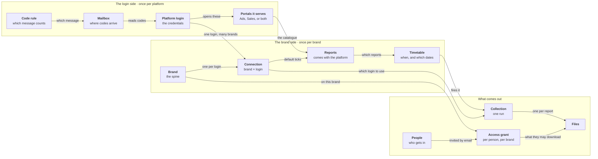

# What you set up, and who can then see it

Twelve things get created, in a particular order, and the order is the part
people get wrong.

> The interactive version — click a block to read what it is, play a
> walkthrough, switch between the admin and brand-team views — is
> `offline/setup.html`. This is the same picture as text, for pasting into a
> wiki.

## The login side — once per platform

| | What it is | Where it is made | What decides whether it works |
|---|---|---|---|
| **Code rule** | Which emailed message counts as this portal's sign-in code | Mailboxes → Code rules | Sender, subject, and the code itself. Test it on a real message first |
| **Mailbox** | The inbox the portals email codes to | Mailboxes → Add mailbox | IMAP host, address, app password. One inbox can serve every login |
| **Platform login** | One set of credentials for one platform | Connect wizard, step 2 | Login id, password, and its inbox. Some portals have no password at all |
| **Portals it serves** | Which of that platform's sites the login can open | Connect wizard, step 1 | Health is tracked per site, so a Sales failure never marks Ads broken |

## The brand side — once per brand

| | What it is | Where it is made | What decides whether it works |
|---|---|---|---|
| **Brand** | One of your client brands | Brands → Add brand | Archived, never deleted |
| **Connection** | Joins one brand to one login, and records which business to open | Connect wizard, step 3 | The portal's own spelling of the business |
| **Reports** | The exports each site offers — you pick, you do not add | Connect wizard, step 4 | A few cap the date range you may ask for |
| **Timetable** | Collects on its own, daily, weekly or monthly | Schedules → New schedule | A brand, its reports, a time in IST, and which dates each run pulls |

## What comes out

| | What it is | Where it is made | What decides whether it works |
|---|---|---|---|
| **People** | Invited by email; a role on its own grants nothing | Users & access → Invite | One link, single use, seven days |
| **Access grant** | What one person may do on one brand | Users & access → grants | Manager or Executive; starting a collection is a separate tick |
| **Collection** | One pass: sign in, check, download, store | Run now, or fired by a timetable | One run per login, one job per report |
| **Files** | The downloaded reports, exactly as the portal produced them | Report library | Renamed on the way out, never edited; every version kept |

---

## Connect a brand, end to end

1. **Add the brand first.** Everything names a brand, so nothing else can be created until one exists.
2. **Add the inbox that receives codes.** One inbox is enough for every platform and every brand.
3. **Check the code rule**, and test it against a real message. A rule that looks right and does not match is the commonest reason a sign-in hangs.
4. **Run the connect wizard.** One pass creates the login, the list of sites it can open, and the connection joining it to this brand.
5. **Test the sign-in and watch it.** This is the only moment the portal's own name for the business is readable. Copy it.
6. **Record which business it should open**, exactly as the portal spells it. A login that opens one business can leave this blank.
7. **Tick the reports.** These pre-fill Run now; they are a convenience, not a rule.
8. **Set the timetable.** Check the preview line — it spells out the real dates the next runs will pull.

## Give someone access

1. **Invite them** — an email address and a role. Single-use link, expires after a week.
2. **A role is not access.** Admins see every brand; a Member sees nothing until granted one.
3. **Grant them a brand** at Manager or Executive. One grant per person per brand.
4. **Decide if they may start a collection.** A Manager always may; for an Executive it is off unless you turn it on.
5. **Narrow it to a category if you need to** — Ads only or Sales only. They cannot even start a collection outside it.

## Something broke

| What you see | Where to look |
|---|---|
| The password was refused | The **login**, not the connection. Never retried automatically — repeating a rejected password is how an account gets locked out |
| It signed in, then downloaded nothing | The business name on the **connection**. It stopped on purpose: a wrong pick produces a believable file for somebody else's business |
| It did not know which business to open | The **connection** has none recorded and this login opens several. Run a test sign-in, copy the name, paste it on |
| The code never arrived | The **mailbox**, or the **code rule**. Testing the rule against a recent message tells you which in one click |
| It stopped dead, mid-collection | The **collection** was marked failed after its machine went quiet. Nothing is damaged; start it again |

---

## Three things that surprise people

- **One inbox serves every login.** Not one per brand, not one per platform. Most setups have exactly one.
- **One login serves many brands.** An agency login is normal, which is why the business it opens is checked before every single download.
- **A timetable never names a login.** It names a brand and a list of reports; the right login is worked out each time it fires.

---

*Brand names shown are placeholders. Stage A collects reports; parsing and
dashboards are later stages.*
